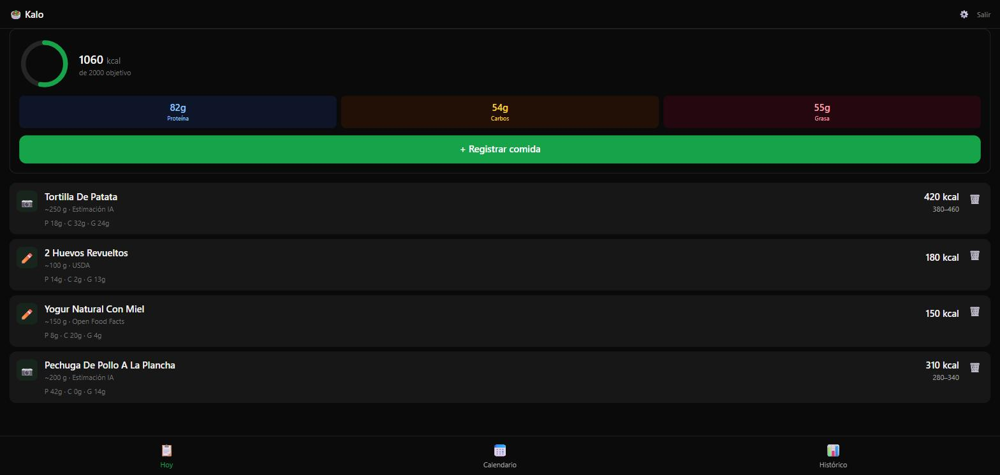
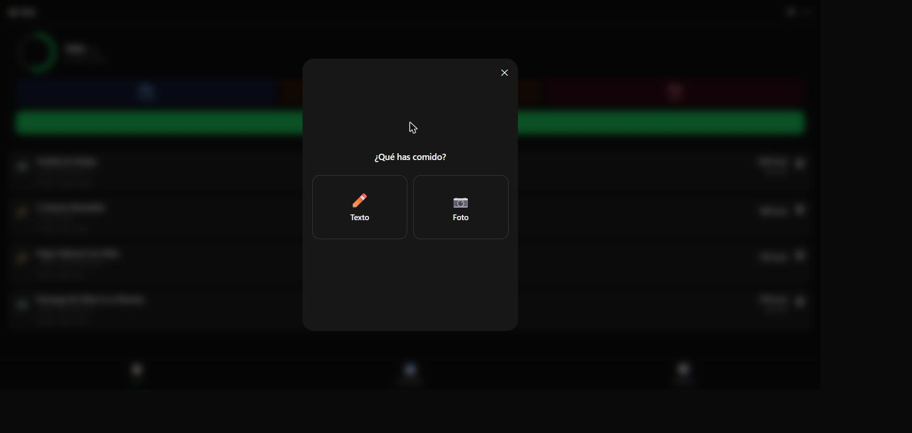
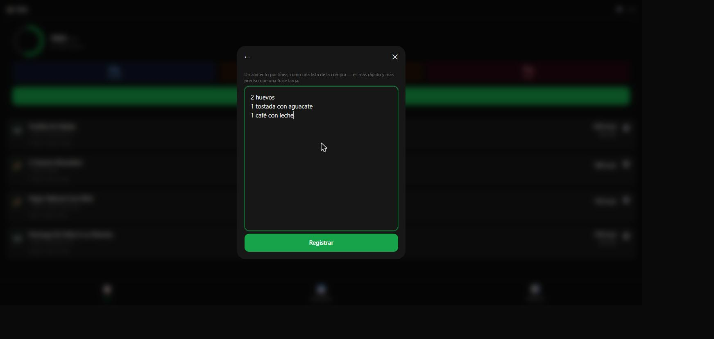

# 🥗 Kalo

Calorie tracker que registra comida "al vuelo" por **texto libre** o **foto**,
sin pesar nada ni buscar en bases de datos manualmente. Una IA (Claude)
interpreta lo que has comido, cruza los datos con bases nutricionales
públicas y guarda el registro. Instalable como **PWA** en el móvil.

[](https://github.com/Mango77x/kalo/actions/workflows/ci.yml)
[](https://github.com/Mango77x/kalo/actions/workflows/deploy.yml)
[](./LICENSE)
[](https://react.dev)
[](https://www.typescriptlang.org)
[](https://supabase.com)
[](https://tailwindcss.com)

**Demo en producción:** [mango77x.github.io/kalo](https://mango77x.github.io/kalo/)

## Capturas

| Hoy | Registrar comida | Lista de la compra |
| --- | --- | --- |
|  |  |  |

## Funcionalidades

- **Registro por texto**: escribe lo que has comido como una lista de la
  compra (`2 huevos`, `1 tostada con aguacate`) y la IA estima
  calorías/macros de cada línea por separado — más rápido y preciso que una
  frase larga.
- **Registro por foto**: haz una foto al plato y Claude analiza la imagen
  para estimar el contenido nutricional.
- **Resolución nutricional en 3 niveles**: cruza la estimación de la IA con
  Open Food Facts (productos envasados) y USDA FoodData Central (alimentos
  frescos/genéricos) antes de guardar el dato final.
- **Histórico y calendario**: navega por días anteriores, revisa totales de
  calorías y macros, y consulta el detalle completo de cada entrada (texto
  original incluido, sin truncar).
- **Borrado de registros** con confirmación, sincronizado en tiempo real.
- **Multi-usuario con BYOK**: cada usuario configura su propia API key de
  Anthropic (cifrada en la base de datos con AES-256-GCM vía Web Crypto),
  así que compartir la app con más gente no consume la cuota de nadie más.
- **Login con Google** (además de magic link por email) para que unirse a
  la app sea instantáneo, sin fricción de verificación por correo.
- **Instalable como PWA** en iPhone/Android — funciona como app nativa desde
  la pantalla de inicio.

## Stack

| Capa | Tecnología |
| --- | --- |
| Frontend | React 19 + Vite + TypeScript, Tailwind CSS v4, Framer Motion, Recharts, React Router |
| Backend | Supabase (Postgres + RLS, Auth con magic link + Google OAuth, Realtime, Edge Functions en Deno) |
| IA | Claude (Sonnet para fotos, Haiku para texto) — la API key nunca vive en el frontend |
| Datos nutricionales | Open Food Facts API + USDA FoodData Central API |
| Infra | GitHub Actions (CI + deploy) → GitHub Pages, PWA vía `vite-plugin-pwa` |

## Arquitectura a alto nivel

```
┌─────────────┐      invoke       ┌────────────────────┐
│   Frontend   │ ────────────────▶ │  Supabase Edge Fn   │
│ (React SPA)  │                   │  log-text-entry /   │
│              │ ◀──────────────── │  log-photo-entry    │
└─────────────┘   entry guardada   └─────────┬──────────┘
       │                                     │
       │ Realtime subscription               │ Claude API (BYOK)
       ▼                                     ▼
┌─────────────┐                    ┌────────────────────┐
│  Postgres    │ ◀───────────────  │ Open Food Facts /   │
│  (RLS)       │   resolución      │ USDA FoodData       │
└─────────────┘   nutricional      └────────────────────┘
```

## Desarrollo local

```bash
npm install
cp .env.example .env   # rellena VITE_SUPABASE_URL y VITE_SUPABASE_ANON_KEY
npm run dev            # http://localhost:5173
```

Scripts disponibles:

| Script | Descripción |
| --- | --- |
| `npm run dev` | Servidor de desarrollo con HMR |
| `npm run build` | Type-check (`tsc -b`) + build de producción |
| `npm run preview` | Sirve el build de producción localmente |
| `npm run lint` | ESLint |
| `npm run format` / `format:check` | Prettier |

Las Edge Functions viven en [`supabase/functions`](./supabase/functions) y se
despliegan con la Supabase CLI (`supabase functions deploy <nombre>`). Cada
usuario configura su propia API key de Anthropic desde los ajustes de la app;
no hace falta ninguna clave de IA a nivel de proyecto.

## CI/CD

- **CI** (`.github/workflows/ci.yml`): en cada push/PR corre `format:check`,
  `lint` y `build` (el build incluye el chequeo de tipos).
- **Deploy** (`.github/workflows/deploy.yml`): en cada push a `main`,
  compila y publica en GitHub Pages bajo `/kalo/`.

## Estado del proyecto

Proyecto en producción, usado activamente por varias personas. Ver
[`PROGRESO.md`](./PROGRESO.md) para la bitácora completa sprint a sprint —
decisiones técnicas, credenciales necesarias en cada fase, y los ajustes
post-lanzamiento (fixes de cámara, coste de tokens, BYOK, login con Google,
etc.).

## Licencia

[MIT](./LICENSE)
